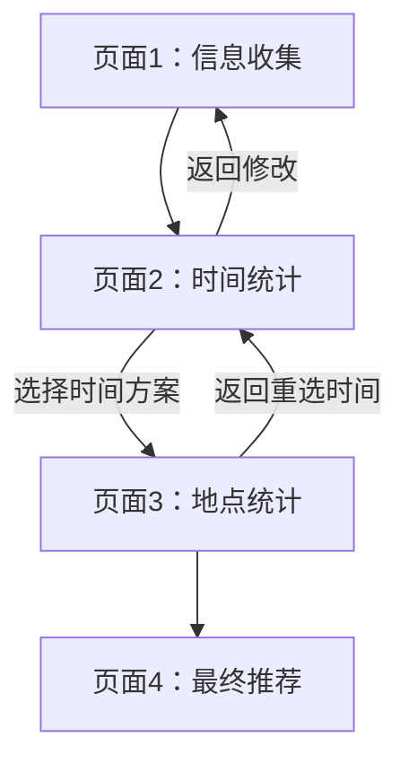

## 1. 产品概述

聚会助手是一个单机版Web应用，帮助聚会组织者收集成员信息、统计时间和地点，最终推荐最优的聚会时间与地点方案。目标用户为小型聚会（5-20人）的组织者，解决多人协调时间地点的痛点。

## 2. 核心功能

### 2.1 用户角色

| 角色 | 说明 |
|------|------|
| 组织者 | 单机操作，录入所有成员信息，执行统计与推荐 |

### 2.2 功能模块

1. **信息收集页**：录入成员昵称、可用时间段、居住地点、预期地点
2. **时间统计页**：统计成员空闲时间，选择聚会时间方案
3. **地点统计页**：基于选定时间方案的参与成员，计算预期地点出行成本
4. **最终推荐页**：汇总推荐时间+地点+理由

### 2.3 页面详情

| 页面名称 | 模块名称 | 功能描述 |
|---------|---------|---------|
| 信息收集 | 用户卡片列表 | 展示所有已录入用户，支持新增/删除用户 |
| 信息收集 | 昵称编辑 | 文本框输入昵称，失焦校验唯一性，重复时红框提示 |
| 信息收集 | 时间记录 | 每条=日期+复选框(上午/下午/晚上)，支持新增/删除/激活/禁用单条记录 |
| 信息收集 | 日期范围选择 | 支持起始~结束日期范围，自动展开为逐日记录，默认全选时段 |
| 信息收集 | 居住地点 | 通过高德Place Suggestion搜索选择，单选，无Key时退化为文本输入 |
| 信息收集 | 预期地点 | 通过高德Place Suggestion搜索选择，多选上限5个，每条支持激活/禁用/删除 |
| 信息收集 | 数据导入导出 | 支持导出/导入JSON数据，方便保存和继续编辑 |
| 时间统计 | 时间段并集统计 | 取所有已激活用户的已激活时间记录并集 |
| 时间统计 | 空闲统计 | 每个时间段统计有空人数和具体昵称 |
| 时间统计 | 排序展示 | 人数降序→日期升序→时段升序(上午<下午<晚上) |
| 时间统计 | 选择时间方案 | 用户点击选择一个时间段作为聚会时间，确定参与成员 |
| 地点统计 | 预期地点并集 | 取选定时间方案中有空成员的已激活预期地点并集 |
| 地点统计 | 出行成本计算 | 通过高德路线规划API计算每个成员居住地→预期地点的出行方式和成本 |
| 地点统计 | 综合排序 | 平均出行时间升序→金额升序，展示详细出行信息 |
| 最终推荐 | 推荐时间 | 展示用户选定的时间方案及参与成员 |
| 最终推荐 | 推荐地点 | 取地点统计排名第1的预期地点 |
| 最终推荐 | 推荐理由 | 生成推荐理由文案，包含参与人数、通勤时间、出行成本等 |
| 最终推荐 | 备选方案 | 展示第2、3名备选地点 |

## 3. 核心流程

用户在信息收集页录入所有成员的昵称、时间段、居住地、预期地点 → 进入时间统计页查看所有时间段的空闲统计，选择一个时间方案确定参与成员 → 进入地点统计页，基于参与成员计算各预期地点的出行成本并排序 → 最终推荐页展示推荐时间、地点和理由。

## 4. 用户界面设计

### 4.1 设计风格

- 主色调：暖橙色(#F97316) + 深灰底(#18181B)，营造聚会温暖感
- 辅助色：浅灰(#F4F4F5)用于卡片背景，绿色(#22C55E)用于激活状态，灰色(#A1A1AA)用于禁用状态
- 按钮：圆角(8px)，实心主按钮+描边次按钮
- 字体：中文使用系统字体栈，数字/英文使用 DM Sans
- 布局：卡片式布局，顶部步骤条导航，移动端单列堆叠
- 图标：使用 lucide-react 图标库

### 4.2 页面设计概览

| 页面名称 | 模块名称 | UI元素 |
|---------|---------|--------|
| 信息收集 | 顶部步骤条 | 1/2/3/4 四步指示器，当前步骤高亮 |
| 信息收集 | 用户卡片 | 圆角卡片，内部按昵称→时间→居住地→预期地排列，右上角删除按钮 |
| 信息收集 | 时间记录行 | 日期选择器+复选框组+激活开关+删除按钮，禁用时灰显+删除线 |
| 信息收集 | 地点选择器 | 搜索框+下拉建议列表，选中后显示标签+清除按钮 |
| 信息收集 | 导入导出按钮 | 顶部工具栏，导出下载JSON，导入选择文件 |
| 时间统计 | 统计表格 | 响应式表格，选中行高亮背景色 |
| 时间统计 | 选择按钮 | 每行右侧单选按钮，选中后显示参与成员预览 |
| 地点统计 | 顶部信息栏 | 显示选定时间和参与成员 |
| 地点统计 | 地点排行卡片 | 卡片列表，每张含地点名、平均时间/金额、展开查看详细出行 |
| 最终推荐 | 推荐卡片 | 大卡片展示推荐时间和地点，附带推荐理由 |
| 最终推荐 | 备选列表 | 紧凑列表展示第2、3名备选 |

### 4.3 响应式设计

- 移动端优先设计（主要使用场景为手机）
- 断点：sm(640px) / md(768px) / lg(1024px)
- 移动端：单列布局，卡片全宽，表格横向滚动
- 桌面端：双列卡片布局，表格正常展示
- 触摸优化：按钮最小44px触摸区域，复选框增大点击区域

### 4.4 地图功能降级策略

- 有高德Key：完整功能（地点搜索建议、路线规划、出行成本计算）
- 无高德Key：地点输入退化为文本输入框，路线规划显示提示"请配置高德地图Key以查看出行成本分析"
- Key配置入口：页面右上角设置图标，弹窗输入Key并保存至localStorage
