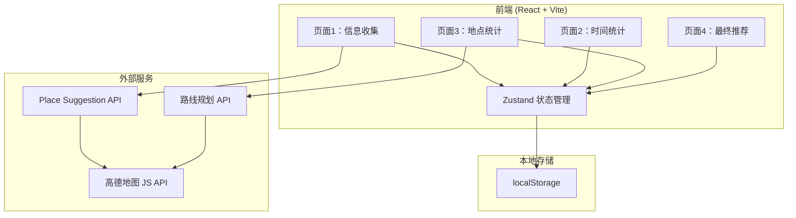
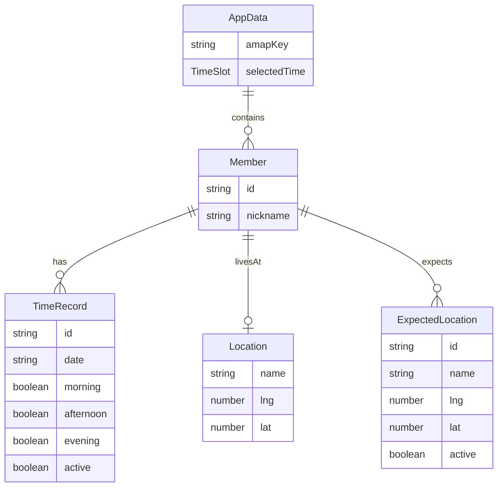

## 1. 架构设计



## 2. 技术说明

- 前端：React 18 + TypeScript + Tailwind CSS + Vite
- 初始化工具：vite-init (react-ts 模板)
- 状态管理：Zustand
- 路由：React Router v6
- 地图服务：高德地图 JS API 2.0（可选配置）
- 数据存储：localStorage（自动保存 + 手动导入导出）
- 图标：lucide-react

## 3. 路由定义

| 路由 | 用途 |
|------|------|
| / | 信息收集页 - 录入成员信息 |
| /time | 时间统计页 - 统计空闲时间并选择方案 |
| /location | 地点统计页 - 计算出行成本并排序 |
| /result | 最终推荐页 - 展示推荐结果 |

## 4. 数据模型

### 4.1 数据模型定义



### 4.2 TypeScript 类型定义

```typescript
interface AppData {
  members: Member[];
  amapKey: string;
  selectedTimeSlot: { date: string; period: 'morning' | 'afternoon' | 'evening' } | null;
}

interface Member {
  id: string;
  nickname: string;
  timeRecords: TimeRecord[];
  residence: Location | null;
  expectedLocations: ExpectedLocation[];
}

interface TimeRecord {
  id: string;
  date: string; // YYYY-MM-DD
  morning: boolean;
  afternoon: boolean;
  evening: boolean;
  active: boolean;
}

interface Location {
  name: string;
  lng: number;
  lat: number;
}

interface ExpectedLocation {
  id: string;
  name: string;
  lng: number;
  lat: number;
  active: boolean;
}

// 路线规划结果
interface RouteResult {
  origin: Location;
  destination: ExpectedLocation;
  driving: { duration: number; tolls: number } | null;
  transit: { duration: number; cost: number } | null;
  bestMode: 'driving' | 'transit' | 'walking';
  bestDuration: number;
  bestCost: number;
}

// 地点统计结果
interface LocationStat {
  location: ExpectedLocation;
  averageDuration: number;
  averageCost: number;
  details: RouteResult[];
}
```

## 5. 核心算法

### 5.1 时间统计算法

```
1. 过滤：只取已激活用户的已激活时间记录
2. 求并集：收集所有 (date, period) 组合
3. 统计：对每个 (date, period)，统计有空的成员
4. 排序：人数降序 → 日期升序 → 时段升序(morning < afternoon < evening)
```

### 5.2 出行成本计算算法

```
1. 确定参与成员：选定时间方案中有空的已激活成员
2. 确定预期地点并集：参与成员的已激活预期地点
3. 对每个(成员居住地, 预期地点)调用高德路线规划：
   - 驾车：获取duration + tolls(过路费)
   - 公交：获取duration + cost(票价)
4. 为每个成员选最优出行方式：
   - 优先选总时长最短的方式；时长相近(差<10min)时选金额更低的
5. 计算每个预期地点的平均出行时间和平均金额
6. 排序：平均时间升序 → 金额升序
```

### 5.3 高德API调用策略

- **Place Suggestion**：输入框debounce 300ms后调用，返回最多10条建议
- **路线规划**：驾车和公交并行请求，单次请求超时5s，失败时该方式标记为null
- **降级**：无Key时地点输入退化为文本，路线规划显示提示信息
- **缓存**：路线规划结果缓存至内存，避免重复请求

## 6. 目录结构

```
src/
├── components/
│   ├── StepIndicator.tsx       # 步骤条导航
│   ├── MemberCard.tsx          # 用户卡片
│   ├── TimeRecordRow.tsx       # 时间记录行
│   ├── LocationSelector.tsx    # 地点搜索选择器
│   ├── SettingsDialog.tsx      # 高德Key配置弹窗
│   ├── ImportExportBar.tsx     # 导入导出工具栏
│   └── RouteDetail.tsx         # 出行详情展开组件
├── pages/
│   ├── InfoCollection.tsx      # 页面1：信息收集
│   ├── TimeStatistics.tsx      # 页面2：时间统计
│   ├── LocationStatistics.tsx  # 页面3：地点统计
│   └── Recommendation.tsx      # 页面4：最终推荐
├── hooks/
│   ├── useAmap.ts              # 高德地图API封装
│   └── useRoutePlan.ts         # 路线规划封装
├── utils/
│   ├── id.ts                   # ID生成
│   ├── export.ts               # 数据导入导出
│   └── calculation.ts          # 统计计算算法
├── store/
│   └── useAppStore.ts          # Zustand全局状态
├── types/
│   └── index.ts                # TypeScript类型定义
├── App.tsx
└── main.tsx
```
